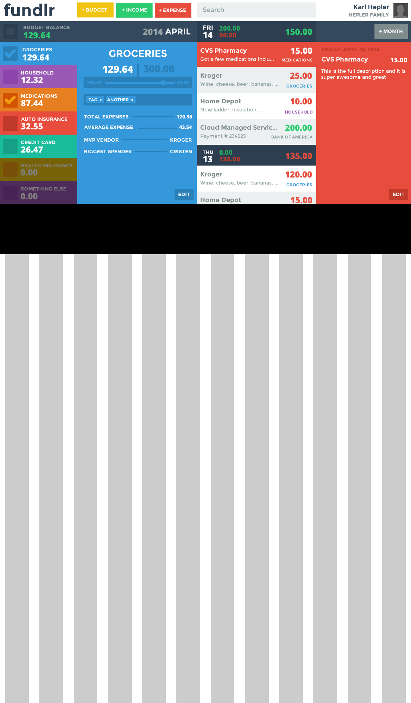

fundlr
========
An easy-to-use online budget app

Design Ideas
===
* In budget detail view, the line items can be customized
  - ie. Total Expenses, Biggest Spender, etc etc
* Tags can be added on the fly
* I need to make the transaction and budget details more similar
* The "banks" area is under the user menu
  - I'm thinking maybe banks can be visible to accounts, and different banks can be visible per user as well... maybe... not sure what the point of that would be though
* The month and the year are clickable - once clicked, you can select a different one
* As checkboxes on budgets are clicked, the transaction list filters

* I need a way to show split transactions... this will make more sense once I have my head around entering a new transaction... start with the total FIRST and go from there

Design
===

[Flat Shadows](http://flattyshadow.com)

Fonts
===
Montserrat Free
http://www.google.com/webfonts#UsePlace:use/Collection:Montserrat

Open Sans Free
http://www.google.com/webfonts#UsePlace:use/Collection:Open+Sans

Colors
===
http://flatuicolors.com