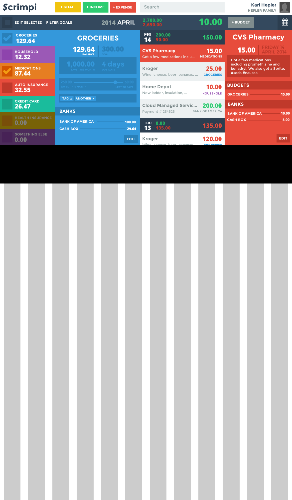

fundlr
========
An easy-to-use online budget app

Design Ideas
===
* ~~In budget detail view, the line items can be customized~~
  - ~~ie. Total Expenses, Biggest Spender, etc etc~~
* Tags can be added on the fly
* I need to make the transaction and budget details more similar
* The "banks" area is under the user menu
  - I'm thinking maybe banks can be visible to accounts, and different banks can be visible per user as well... maybe... not sure what the point of that would be though
* The month and the year are clickable - once clicked, you can select a different one
* As checkboxes on budgets are clicked, the transaction list filters

* ~~I need a way to show split transactions... this will make more sense once I have my head around entering a new transaction... start with the total FIRST and go from there~~

Now that I have revised the dashboard, I am coming to understand that transactions are independent of
banks and budgets... kind of. One transaction can have many bank associations and many budget assocations,
each of which are different. When you put in a transaction, you basically take your receipt and put in
the total. From there, you can divy up what was spent where.

~~The **credit cards** budget should be special... it should house all credit cards under one budget
that is automatically placed at the bottom of all of the other budgets and *can* be moved, but with
a warning. In the budget detail, it should list the credit cards, their balances, and their minimums.
You should be able to create a transaction for each card with one click.~~

~~As I'm writing this, I'm thinking that maybe all budgets should work in a similar way... maybe on the left
budget list bar, instead of an actual budget, maybe it should be a budget category. No... the automobile
category makes this idea fail. Gas is more important than groceries in some cases, but I could not imagine
that all auto expenses, including preventative maintenance could be the same.~~

I'm thinking of having fundlr **automatically** zero out the budget... so there shouldn't be a need
for a budget balance or any kind of "safe to spend" thing. If you want to increase a budget amount,
you need to decrease the funds from other budgets.

Due dates on bills need to be taken into account as well. If a due date is coming up or is here
and the bill budget doesn't have the funds, but budgets above it do, then it will recommend that you
take money out of the other budgets to pay the bill. However, it will not force this.

* Incomes and Expenses can be scheduled for the future and set to repeat

* Budgets can be a part of sinking funds as well - this is set up in the + Budgets screen

---

Data Storage
===

I'm trying to understand the relationship between "goals" and "budgets". It is possible they are the same,
but it's also possible that they are different. It's one of the things that always seems to hang me up when
I think about this.

A budget *can* have a due date... but it's just not important... except to remind you if a bill is due. It
doesn't affect how quickly the budget gets filled... that's determined by the order alone. So you could say
that all budgets have due dates of the end of the month unless they are bills due on a certain day, in which
they would have a due date on that date within the month... ok... nothing special.

The problem comes when I think about goals, with due dates beyond the current month. Let's say there's a
goal that has a due date that is 3 months out, I have a couple of options

1. Use that due date to dynamically calculate (dividing total by number of months) the budget limit for the month
and return that dynamic amount as a virtual budget when called for.

2. Use that due date to calculate as before, but in doing so, generate an actual budget object with the mathematically
correctly parameters.

The benefit of #1 is that I could probably make a single schema for both budgets and goals.
The benefit of #2 is that the budget schema would be simple and the goal schema would be separate.

The question is, is there a reason to make the goal schema separate. Will there ever be a moment when I can remove
the goal itself and retain the budget? I don't think so... so that tells me that the goals and the budgets
associated with those goals are interconnected... So I'm thinking that budgets are goals. Let's think through this:

- All schemas need to have created and modified fields as well (datetime)

- I was thinking that the budget needs another field to show how full it is... but then I thought...

Budgets are like saving accounts
===

- There can be an optional limit on the amount of money that can go in the savings account
- There can be a due date for when that amount must be in there
- There is a limit on how much money you want to put in that savings account per month, depending on the due date
- When you spend money out of it, however, it comes out of the entirety of the savings account... not just the amount for the month
- So when listing the budgets on the left, the number displayed needs to be the balance of the savings account
  - Given this information, I think I need to rethink things...

```javascript
// Rethinking

Savings {
  
  _id:      Number
  name:     String
  balance:  Number
  limit:    Number
  duedate:  Date

}

Budget {
  
  _id:      Number
  savings:  Savings
  limit:    Number
  funded:   Number
  balance:  Number
  spent:    Number

}

```

```javascript
Budget {
  
  _id: int,         // ID... duh
  name: string,     // Name of the budget > this is **NOT** unique... this is so we can copy goals from one month to the next
  duedate: date,    // Duedate of the budget... defaults to end of month. Can be set for future dates
  priority: number, // duh

  goal: number,     // The maximum amount of money that can ever go in this budget... usually this will be the same as limit
  limit: number,    // The maximum amount of money that can go into this budget for the current month
  balance: number,  // How much money is left in this budget
  spent: number,    // How much money has been spent out of this budget

  banks: [],        // Array of banks, in order, for this budget
  tags: []          // Array of tags

}

Tag {
  _id: int,
  name: string
}

Contact {           // Contacts can incorporate more information later as needed.. ie. address, phone, etc
  _id: int,
  name: String
}

Transaction {
  
  _id: int,         // ID
  contact: Contact, // The payee / payer of the transaction
  comment: text,    // A description of the transaction. This is also parsed for hashtags, which are then added or removed from the tags field
  date: Date,       // date transaction took place... could be set for the future
  tags: [],         // Array of tags

  amount: number,   // pos or neg depending on transaction type

  budgets: [{       // Array of budgets associated with the transaction and the amount spent there
    amount: Number, // All budget amounts together, must add up to the main amount
    budget: Budget
  }],      
  banks: [{         // Array of banks associated with transaction and the amount spent there
    amount: Number, // All bank amounts together must add up to the main amount
    bank: Bank
  }]       

}

Bank {              // Banks can incorporate more info later if needed... ie. address, phone, etc
  _id: int,
  name: String,
  priority: int,    // All banks have a default priority
  balance: Number,  // How much money is current in this bank - this is only reduced via a transaction
}
```

---

Design
===


[Flat Shadows](http://flattyshadow.com)


Fonts
===
Montserrat Free
http://www.google.com/webfonts#UsePlace:use/Collection:Montserrat

Open Sans Free
http://www.google.com/webfonts#UsePlace:use/Collection:Open+Sans

Colors
===
http://flatuicolors.com